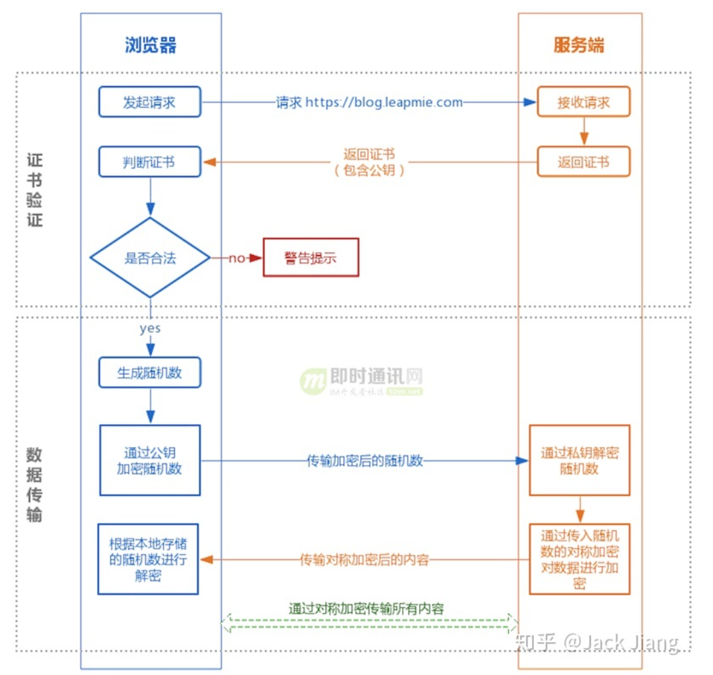
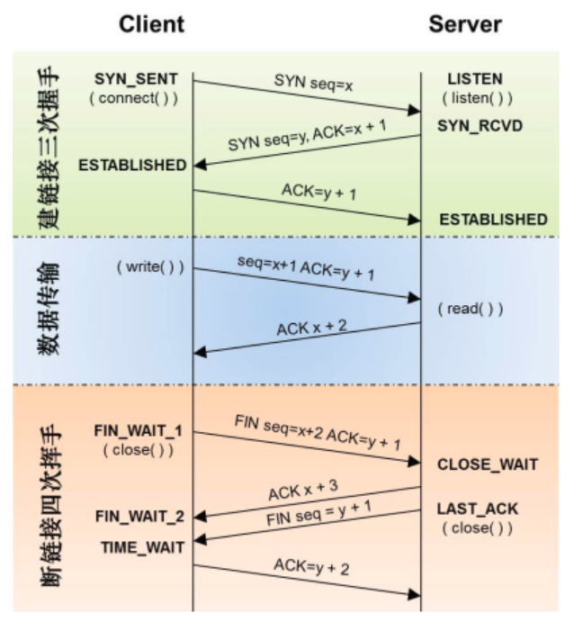

1. GET和POST区别：
   - get是获取数据，post是修改数据
   - get把请求的数据放在url上，以？分割URL和传输数据，参数之间以&相连，所以get不太安全。
     而post把数据放在HTTP的包体内
   - get提交的数据最大是2k(限制实际上取决于浏览器)，post理论上没有限制
   - GET产生一个TCP数据包，浏览器会把http header和data一并发送出去，服务器响应200；
     POST产生两个数据包，浏览器先发送header，服务器响应100 continue，浏览器再发送data，
     服务器响应200 ok(返回数据)
   - GET请求会被浏览器主动缓存，而POST不会，除非手动设置
   - 本质区别：GET是幂等的，而POST不会，除非手动设置
2. Chrome最多允许对同一个Host建立六个TCP连接。不同浏览器有一些区别
3. Cookie是服务器发送到用户浏览器并保存在本地的一小块数据，它会在浏览器之后向同一服务器再次发送 请求时被携带上，用于告知服务端两个请求是否来自同一浏览器。
   Cookie的出现是因为HTTP是无状态的一种协议，Cookie的作用就好比服务器给你贴个标签，然后你每次向服务器再发请求时，服务器就能够cookie认出你。
4. Session工作原理:客户端登录完成之后，服务器会创建对应的session，session创建完之后，会把session的id发送给客户端，客户端再存储到浏览器中。这样客户端每次访问服务器时，都会带着sessionID，服务器拿到sessionID后，在内存找到对应的session就可以正常工作了。
5. TCP头部：序号、确认号、首部长、标志位、窗口、校验和
6. UDP 面向无连接、有单播、多播和广播，面向报文、不可靠性、头部开销小，传输是数据报文时高效
   TCP 面向连接，点对点通信，面向字节流，可靠传输，拥塞控制，全双工，首部大
   确认和超时重传 数据校验 数据合理分片和排序 流量控制 拥塞控制
7. 应对SYN洪泛攻击：
   - 缩短超时(SYN Timeout)时间
   - 增加最大半连接数
   - 过滤网关防护
   - SYN cookies技术
8. 
9. 幂等性是系统的接口对外一种承诺，承诺只要调用接口成功，外部多次调用对系统的影响是一致性的，声明为幂等的接口会认为外部调用失败是常态，并且失败之后必然会有重试。
10. - 物理层：利用物理传输介质为数据链路层提供物理连接，以透明地传送比特流
    - 数据链路层：在通信实体之间建立数据链路连接，传送以帧为单位的数据
    - 网络层：执行路由选择算法，为报文分组通过通信子网选择最合适的路径
    - 传输层：传输层是向用户提供可靠的端到端服务，透明地传送报文
    - 会话层：组织同步地两个回话用户之间的对话，并管理数据的交换。
    - 表示层：处理两个通信系统间信息交换的表示方式
    - 应用层：提供应用进程所需要的信息交换和远程操作，同时作为应用进程的用户代理，完成一些为进行语义上有意义的信息交换所必须的功能。
11. 正向代理：
    - 访问原来无法访问的资源，如Google
    - 做缓存，加速访问资源
    - 对客户端访问授权，上网进行认证
    - 代理可以记录用户访问记录(上网行为管理)，对外隐藏用户信息
    反向代理：
    - 保证内网安全，阻止web攻击，大型网站将反向代理作为公网访问地址，web服务器是内网
    - 负载均衡，通过反向代理服务器来优化网站的负载
12. ARP地址解析协议：
    - 首先，每个主机都会在自己的ARP缓冲区中建立一个ARP列表，以表示IP地址和MAC地址之间的对应关系
    - 当源主机要发送数据时，首先检查ARP列表中是否有对应IP地址的目的主机的MAC地址，如果有，则直接发送数据，如果没有，就向本网段的所有主机发送ARP数据包，该数据包包括的内容有：源主机IP地址、源主机MAC地址，目的主机的IP地址
    - 当本网络的所有主机收到该ARP数据包时，首先检查数据包中的IP地址是否是自己的IP地址，如果不是，则忽略该数据包，如果是，则首先从数据包中取出源主机的IP和MAC地址写入到ARP列表中，如果已经存在，则覆盖，然后将自己的MAC地址写入ARP响应包中，告诉源主机自己是它想要找的MAC地址
    - 源主机收到ARP响应包后，将目的主机的IP和MAC地址写入ARP列表，并利用此信息发送数据，如果源主机一直没有收到ARP响应数据包，表示ARP查询失败。
    广播发送ARP请求，单播发送ARP响应。
13. TCP四种定时器
    - 重传计时器：为了防止报文丢失或者阻塞。当A向B发送报文时，会启动重传定时器，
                  若在定时器到达之后，仍未收到B的确认报文，则A会重新发送上次发送的报文。
    - 坚持计时器：接收方发送0窗口报文后，又有空间，向发送方发送非0窗口报文该
                报文如果在网络中阻塞或者丢失，接收方和发送方会陷入死锁。因此发送方在收到零窗口报文后，设置坚持计时器，隔一段时间发送一个窗口探测报文。
    - 保活计时器：客户机因某些故障退出，服务器并不知道，还在等待客户机发来数据，
                 白白浪费计算机资源。服务器设置保活计时器，每收到客户机的一次消息，重置保活计时器，时长2小时。若2小时没收到客户机的消息，就每隔75分钟发送探测报文，连续发送10次，还未应答，就认为客户机故障，断开此次连接。
    - 时间等待计时器：2MSL 时间，为了保证服务器能够收到客户机发送的最后一个
                     确认报文；防止出现“已失效的连接请求报文”再次出现的情况。  
    
14. HTTP/1.x   
    - 高延迟--带来页面加载速度的降低
    - 无状态特性--带来的巨大HTTP头部
    - 明文传输--带来不安全性
    - 不支持服务器推送消息
   HTTP/2
   - 二进制编码传输
   - Header压缩
   - 多路复用，解决限制同一域名下的请求数量问题
   - Server Push 服务器不再是完全被动地响应请求，可以新建“流”主动向客户端发送消息。
   - 提高安全性 
   HTTP/3 解决TCP+TLS建立连接时的延时问题；HTTP/2中的多个请求是跑在一个TCP管道中当出现丢包是，整个TCP都要等待重传，就会阻塞TCP连接中的所有请求。而对于HTTP/1.1， 可以开启多个TCP连接，丢包只会影响其中一个连接，剩余的TCP连接还可以正常传输数据。  
   QUIC基于UDP
   - 实现了类似TCP的流量控制、传输可靠性的功能
   - 实现了快速握手的功能
   - 集成了TLS加密功能
   - 多路复用，彻底解决TCP中队头阻塞问题，同一物理连接上可以有多个独立的逻辑数据流
15. ping ICMP协议  A ping B
系统建立固定格式的ICMP请求数据包——ICMP协议打包这个数据包和B的IP地址转交给IP协议层——IP层以B的IP为目的，A的IP为源，加上控制信息，构建IP数据包——获取B的MAC地址——数据链路层构建数据帧，依据以太网的介质访问规则传送出——B收到后，检查MAC地址和IP地址——构建ICMP应答包，发给A