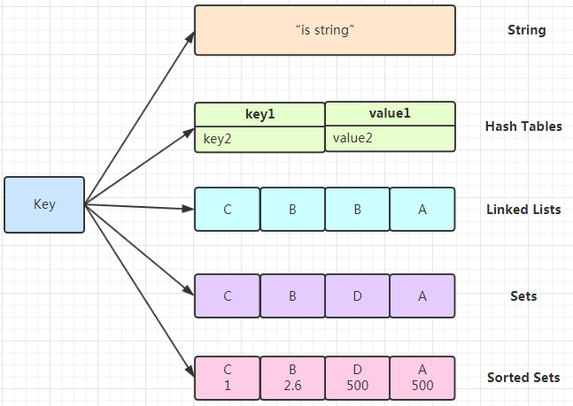

1. Redis的五种数据结构整理  
   
  (1) 简单动态字符串(SDS)  
     SDS等同于C语言中的char*，但它可以存储任意二进制数据，不能像C语言字符串那样以字符'\0'来标识字符串的结束，因此它必须有个长度字段  

     struct sdshdr{
         // 记录buf数组中已使用字节的数量
         // 等于sds所保存字符串的长度
         int len;

         //记录buf数组中未使用字节的数量
         int free;

         //字节数组。用于保存字符串
         char buf[];
     }
    优点：
    - 获取字符串长度的复杂度为O(1)
    - 杜绝缓冲区溢出
    - 减少修改字符串长度时所需要的的内存重分配次数
    - 二进制安全
    - 兼容部分C字符串函数
     
  (2) 链表  
  节点底层结构
  ```c++
  typedef struct listNode{
      //前置节点
      struct listNode *prev;
      struct listNode *next;
      //节点的值
      void* value;
  }listNode;
  ```
  list底层结构
  ```C++
  typedef struct list{
      //表头节点
      listNode *head;
      //表尾节点
      listNode *tail;
      //链表所包含的节点数量
      unsigned long len;
      //节点值复制函数
      void (*dup)(void *ptr);
      //节点值放过函数
      void (*free)(void *ptr);
      //节点值对比函数
      int (*match)(void *ptr,void *key);
  }list;
  ```
  特性：
   - 链表被广泛用于实现Redis的各种功能，比如列表建、发布与订阅、慢查询、监视器等
  - 每个链表节点由一个listNode结构来表示，每个节点都有一个指向前置节点和后置节点的指针，所以Redis的链表实现是双端链表
  - 每个链表使用list结构表示，这个结构带有表头节点指针、表尾节点指针，以及链表长度等信息
  - 因为链表表头的前置节点和表尾的后置节点都指向NULL，所以Redis的链表实现是无环链表
  - 通过为链表设置不同的类型特定函数，Redis的链表可以用于保存各种不同类型的值。

(3)字典
哈希表
``` C++
typedef struct dictht{
    // 哈希表数组
    dictEntry **table;
    //哈希表大小
    unsigned long size;
    // 哈希表大小掩码，用于计算索引值
    //总是等于size-1
    unsigned long sizemark;
    // 该哈希表已有节点的数量
    unsigned long used;
}dicht;
```
特性：
- 字典被广泛用于实现Redis的各种功能，其中包括数据库和哈希键
- Redis中的字典使用哈希表作为底层结构实现，每个字典带有两个哈希表，一个平时使用，另一个仅在进行rehash时使用
- Redis使用MurmurHash算法来计算键的哈希值
- 哈希表使用链地址法来解决键冲突
（4）跳跃表
zskiplistNode
```C++
typedef struct zskiplistNode{
    //后退指针
    struct zskiplistNode *backward;
    //分值 权重
    double score；
    //成员对象
    robj *obj;
    struct zskiplistLevel{
        //前进指针
        struct zskiplistNode *forward;
        //跨度
        unsigned int span;
    }leval[];
}zskiplistNode;
```
zskipList
```C++
typedef struct zskiplist{
    //表头节点和表尾节点
    strcut zskiplistNode *header,*tail;
    //表中节点的数量
    unsigned long length;
    //表中层数最大的节点的层数
    int leval;
}zskiplist;
```
特性：
- 跳跃表是有序集合的底层实现之一
- Redis的跳跃表实现由zskiplist和zskiplistNode两个结构组成，其中zskiplist用于保存跳跃表信息(如表头节点、表尾节点、长度)，而zskiplistNode则用于表示跳跃表节点
- 每个跳跃表节点的层高都是1至32之间的随机数
- 在同一跳跃表中，多个节点可以包含相同的分值，但每个节点的成员对象必须是唯一的。
- 跳跃表中的节点按照分值大小进行排序，当分值相同时，节点按照成员对象的大小进行排序
- 调表是一种实现起来很简单，单层多指针的链表，查找效率很高
- 

2. Memcached与Redis的区别
   - 存储方式
     - Memcache把数据全部存在内存之中，断电后会挂掉，没有持久化功能，数据不能超过内存大小
     - Redis有部分存在硬盘上，这样能保证数据的持久性
   - 数据支持类型
     - Memcache只有string类型，Redis还有list,set,zset,hash等数据结构
   - 使用底层模型不同
     - 底层实现方式以及与客户端之间通信的应用协议不一样
     - Redis自己构建了VM机制，一般的系统调用系统函数会浪费一定的时间去移动和请求
   - 集群模式：Memcached没有原生的集群模式，需要依靠客户端来实现往集群中分片写入数据；但是Redis原生支持cluster模式
   - Memcached是多线程，非阻塞IO复用的网络模型；Redis使用单线程的多路IO复用模型
   - value值大小不同：redis最大512MB，Memcached只有1MB
3. Redis是基于内存的操作，CPU不是其瓶颈，机器内存的大小或者网络带宽是其重要影响因素，单线程容易实现。
4. 单线程的Redis速度很快：
   - Redis的全部操作都是纯内存的操作
   - Redis采用单线程，有效避免了频繁的上下文切换
   - 采用了非阻塞IO多路复用机制
5. Redis的线程模型
   
    文件事件处理器的结构包含4个部分：
    - 多个socket
    - IO多路复用程序
    - 文件事件分派器
    - 事件处理器(连接应答处理器、命令请求处理器、命令回复处理器)  
    IO多路复用程序负责监听多个套接字，并向文件事件分派器传送那些产生了事件的套接字
6. Redis设置过期时间的方案
   - 定期删除：Redis默认每隔100ms就随机抽取一些设置了过期时间的key，检查其是否过期，如果过期就删除。
   - 惰性删除：定期删除可能导致很多过期key到了时间并没有被删除掉。惰性删除指某个键值过期后，此键值不会马上被删除，而是等到下次被使用的时候，才会被检查到过期，此时才能得到删除。
   - 内存淘汰机制
7. 缓存雪崩：
   同一时间大面积的失效，后面的请求都会落到数据库上，造成数据库短时间内承受大量请求而崩掉  
   解决办法： 
   - 事前：尽量保证整个Redis集群的高可用性，发现机器宕机尽快补上，选择合适的内存淘汰策略
   - 事中：本地ehcache缓存+hystrix限流&降级，避免MySQL崩掉，通过加锁或者队列来控制读数据写缓存的线程数量。比如对某个key只允许一个线程查询数据和写缓存，其他线程等待。
8. 缓存穿透：一般是黑客故意去请求缓存中不存在的数据，导致所有的请求都落在数据库上，造成数据库短时间内承受大量请求而崩掉
   - 布隆过滤器
   - 缓存空对象
9. 缓存预热：指系统上线后，将相关的缓存数据直接加载到缓存系统。这样可以避免在用户请求的时候，先查询数据库，然后再将数据缓存的问题。
10. 缓存更新
11. 缓存降级：当访问量剧增、服务出现问题(如响应时间慢或不响应)或非核心服务影响到核心流程的性能时，仍然需要保证服务还是可用的，即使是有损服务。
12. Redis是一个支持持久化的内存数据库，通过持久化机制把内存中的数据同步到硬盘文件来保证数据持久化。  
    实现：单独创建fork()一个子进程，将当前父进程的数据库数据复制到子进程的内存中，然后由子进程写入到临时文件中，持久化的过程结束了，再用这个临时文件替换上次的快照文件，然后子进程退出，内存释放。
    - 快照持久化(RDB持久化)
    Redis可以通过创建快照来获得存储在内存里面的数据在某个时间点上的副本。Redis创建快照后，可以对快照进行备份，可以将快照复制到其他服务器从而创建具有相同数据的服务器副本，还可以将快照留在原地以便重启服务器的时候使用功能。
    - AOF持久化
    实时性更好。开启AOF持久化后每执行一条会更改Redis中的数据的命令，Redis就会将该命令写入硬盘中的AOF文件。AOF文件的保存位置和RDB文件的位置相同，都是通过dir参数设置的。
13. AOF重写
    在执行BGREWRITEAOF命令时，Redis服务器会维护一个AOF**重写缓冲区**，该缓冲区会在子进程创建新AOF文件期间，记录服务器执行的所有写命令。**当子进程完成创建新AOF文件的工作之后，服务器会将重写缓冲区中的所有内容追加到新AOF文件的末尾，使得新旧两个AOF文件所保存的数据库状态一致**。最后，服务器用新的AOF文件替换旧的AOF文件，以此来完成AOF文件重写操作。
14. 缓存与数据库双写时的数据一致性  
    最经典的缓存+数据库读写的模式是预留缓存模式  
    - 读的时候，先读缓存，没有缓存，就读数据库，然后取出数据后放入缓存，同时返回响应。
    - 更新的时候，先删除缓存，然后再更新数据库，这样读的时候就会发现缓存中没有数据而直接去数据库中拿数据了。
15. 


    
