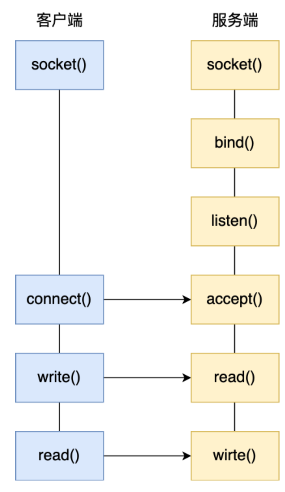
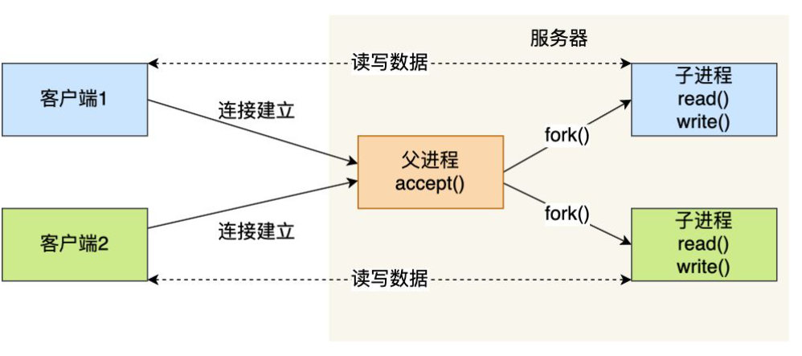
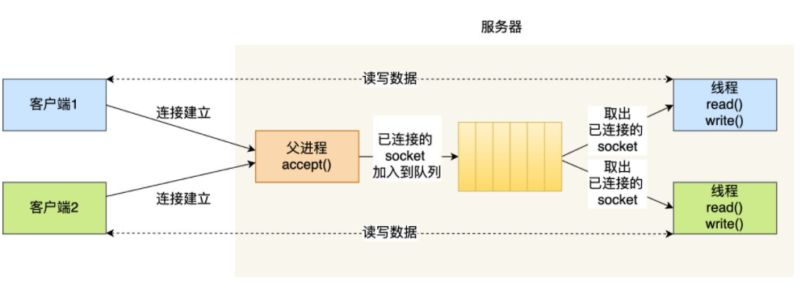
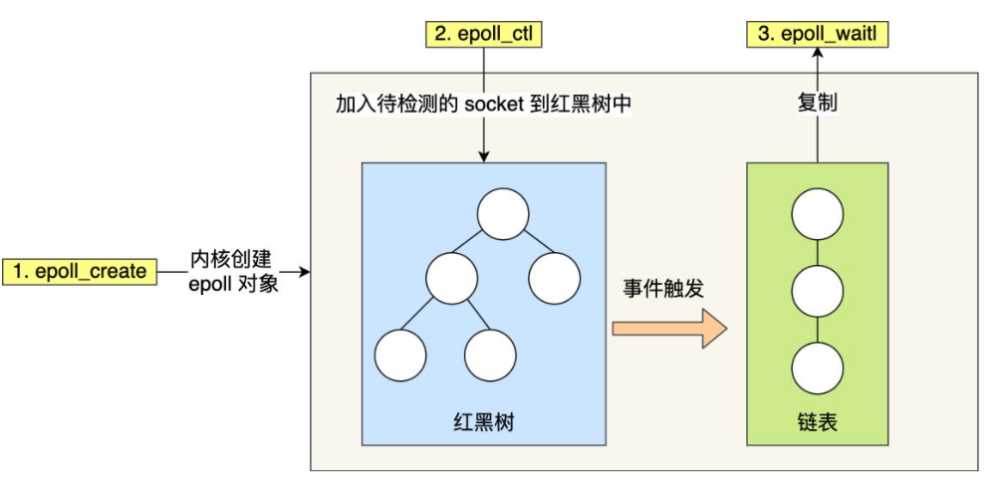
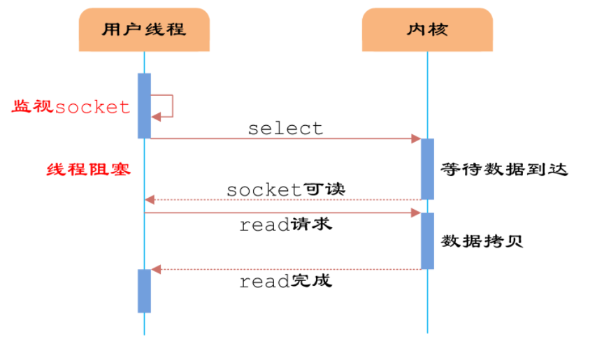

1. 最基本的socket模型  
   创建socket时，网络层可以使用IPv4还是IPv6，传输层可以是TCP或UDP  
   服务端的程序要先运行起来，然后等待客户端的连接和数据  
   **服务端**首先调用socket()函数，创建网络协议为IPv4，以及传输协议为TCP的Socket，接着调用bind()函数，给这个Socket绑定一个IP地址和端口  
   绑定端口：当内核收到TCP报文，通过TCP头里面的端口号，来找到应用程序，然后把数据传递给我们  
   绑定IP：一台机器可以有多个网卡，每个网卡都有对应的IP地址，当绑定一个网卡时，内核收到该网卡上的包，才会发给我们。  
   绑定完IP地址和端口后，可以调用listen()函数进行监听，可以使用netstat命令查看对应的端口号是否有被监听。  
   服务端进入监听状态后，通过调用accept()函数，来从内核获取客户端的连接，如果没有客户端连接，则会阻塞等待。  
   **客户端**在创建好Socket后，调用connect函数发起连接，该函数的参数要指明服务端的IP地址和端口号，然后TCP三次握手  
   在TCP连接的过程中，服务器的内核实际上为每个Socket维护了两个队列：
   - 一个是还没完全建立连接的队列，称为TCP半连接队列，这个队列都是没有完成三次握手的连接，此时服务端处于syn_rcvd的状态
   - 一个是已建立连接的队列，称为TCP全连接队列，这个队列都是完成了三次握手的连接，此时服务端处于established状态  
   当TCP全连接队列不为空时，服务端的accept()函数，就会从内核中的TCP全连接队列里拿出一个已经完成连接的Socket返回应用程序，后续数据传输都用这个Socket。  
   监听Socket和已连接Socket  
   连接建立后，客户端和服务端就开始相互传输数据了，双方都可以通过read()和write()函数来读写数据。
   
2. 服务器单机理论最大能连接的客户端  
    TCP连接时有四元组(本机IP、本机端口、对端IP、对端端口)唯一确认  
    服务器作为服务方，通常会在本地固定监听一个端口，等待客户端的连接。因此服务器本地IP和端口是固定的。  
    最大TCP连接数=客户端IP数*客户端端口数。  
    对于IPv4,客户端的IP数最多为2的32方，客户端端口数最多为2的16方，服务端单机最大TCP连接数约为2的48方。  
    最大连接数收敛两个方面的限制：  
    **文件描述符**socket实际上是一个文件，对应一个文件描述符。在Linux下，单个进程打开的文件描述符数是有限制的，一般是1024。  
    **系统内存** 每个TCP连接在内核中都有对应的数据结构，意味着每个连接都会占用一定内存；  
3.多进程模型  
    对于最基本的Socket模型，通信是点对点的，使用同步阻塞的方式，当服务端在还没有处理完一个客户端的网络I/O时，或者读写操作发生阻塞时，其他客户端是无法与服务端连接的。资源浪费、效率低下。  
    **多进程模型** 为每个客户端分配一个进程来处理请求。  
    服务器的主进程负责监听客户的连接，一旦与客户端连接完成，accept()函数就会返回一个[已连接Socket]，这时就会通过fork()函数创建一个子进程，把父进程所有相关东西都复制一份(文件描述符、内存地址空间、程序计数器、执行的代码)  
    子进程便可以使用[已连接Socket]和客户端通信。  
    父进程需要做好子进程退出后资源的回收，以防止子进程变成僵尸进程，调用wait()和waitpid()函数  
    **缺点** 当客户端的数量变多，进程数会增加，占用系统资源的同时，进程间上下文切换效率也很低下。  
    
4. 多线程模型  
   一个进程可以拥有多个线程，线程可以共享进程的部分资源  
   当服务器与客户端TCP完成连接后，通过pthread_create()函数创建线程，然后将[已连接Socket]的文件描述符传递给线程函数，接着在线程里和客户端进行通信，从而达到并发处理的目的。  
   线程池可以避免线程的频繁创建和销毁。线程池就是提前创建若干线程，当新连接建立时，将这个已连接的Socket放入到一个队列里，然后线程池里的线程负责从队列中取出已连接Socket进行处理。  
   
    **缺点**  
    基于进程或者线程模型的，处理新的TCP连接都要分配一个进程或线程，如果要达到C10K，意味着一台机器维护1万个连接，相当于维护1万个进程/线程，操作系统就算死扛也扛不住。
5. I/O多路复用  
   一个进程虽然任一时刻只能处理一个请求，但是处理每个请求的事件时，耗时控制在1毫秒内，这样1秒就可以处理上千个请求，把时间拉长来看，多个请求复用了一个进程，即是多路复用。  
    **select**：将已连接Socket都放到一个文件描述符集合，然后调用select函数将文件描述符集合拷贝到内核里，内核通过遍历文件描述符集合来检查是否有网络事件产生；当检查到有事件产生后，将此Socket标记为可读或可写，接着再把整个文件描述集合拷贝回用户态，然后用户态还需要通过遍历找到可读或可写的Socket，然后再对其处理。  
    select需要进行**两次[遍历]文件描述符集合**，还会发生**两次[拷贝]文件描述符集合**  
    select使用固定长度的BitsMap，表示文件描述符集合，而且所支持的文件描述符的个数是有限制的。  
    **poll**用动态数组来存储文件描述符，以链表形式组织。  
    **epoll**  
    fisrt，epoll在内核里使用**红黑树来跟踪进程所有待检测的文件描述字**，把需要监控的socket通过epoll_ctl()函数加入内核中的红黑树里，只需传入一个待检测的socket，减少了内核和用户空间大量的数据拷贝和内存分配。通过对红黑树进行操作，不需要像select/poll每次操作时都传入整个socket集合  
    second，epoll使用事件驱动机制，内核里**维护了一个链表来记录就绪事件**，当某个socket有事件发生时，通过回调函数内核会将其加入到这个就绪事件列表中，当用户调用epoll_wait()函数时，只会返回有事件发生的文件描述符的集合，不需要像select/poll那样轮询扫描整个socket集合，大大提高了检测的效率。  
    epoll方式监听的Socket数量越多的时候，效率不会大幅度降低，能够同时监听的Socket数目也非常多了，上限为系统定义的进程打开的最大文件描述符个数。    
    **触发模式**  
    边缘触发(edge-triggered,ET)
    当使用边缘触发模式时，当被监控的Socket描述符上有可读事件发生时，**服务器端只会从epoll_wait中苏醒一次**，即使进程没有调用read函数从内核读取数据，也只苏醒一次，因此程序要保证一次性将内核缓冲区的数据读取完。  
    水平触发(level-triggered,LT)  
    当时用水平触发模式时，当被监控的Socket上有可读事件发生时，**服务器端把不断地从epoll_wait中苏醒，直到内核缓冲区数据被read函数读完才结束**，目的是告诉我们有数据需要读取。  
    使用边缘触发模式，I/O事件只会通知一次，而且不知道能读写多少数据，所以受到通知后应尽可能读写数据，以免错失读写的机会。因此，我们会循环从文件描述符读写数据，如果文件描述符是阻塞的，没有数据可读写时，进程会阻塞在读写函数那里，程序便没办法执行下去。  
    **边缘触发模式一般和非阻塞I/O搭配使用**
    
    多路复用本质是同步非阻塞I/O，多路复用的优势并不是单个连接处理的更快，而是在于能处理更多的连接。  
    I/O编程过程中，需要同时处理多个客户端接入请求时，可以利用多线程或者I/O多路复用技术进行处理。  
    I/O多路复用模型是建立在内核提供的多路分离函数select基础之上的，使用select函数可以避免同步非阻塞I/O模型中轮询等待的问题。  
    从流程上来看，使用select函数进行IO请求和同步阻塞模型没有太大的区别，甚至还多了监视socket，以及调用select函数的额外操作，效率更差。select的优势是用户可以在一个线程内同时处理多个socket的IO请求，用户可以注册多个socket，然后不断地调用select读取被激活的socket，即可达到在**同一线程内同时处理多个IO请求的目的**。  
    
    缺点：  
    - select 会修改传入的参数数组，对一个需要调用很多次的函数非常不友好；
    - select 如果任何一个sock出现了数据，仅仅会返回存在数据，但是不会告诉哪个sock上有数据；
    - select 只能监视1024个链接
    - select 不是线程安全的。如果一个sock加入到select，然后另一个线程发现这个sock不用要收回，select是不支持的。如果强制收回，未来的事是不可预测的。  
    poll解决了链接限制的问题；也不会修改传入的参数数组了  
    epoll解决了select和poll存在的大部分问题。  
6. 线程安全是指在堆内存中的数据由于可以被任何线程访问到，在没有限制的情况下存在被意外修改的风险。  
   局部变量存在于栈内存中，私有变量，是安全的。  
   ThreadLocal就是，把一个数据复制N份，没个线程认领一份，各玩各的，互不影响。  
   直接规定，只能读取，禁止修改，安全。  
   CAS(Compare And Swap) 并发很小的情况下，数据被意外修改的概率很低，但是又存在这种可能性。提前保存数据以对比。  
   **乐观锁**
   **悲观锁**